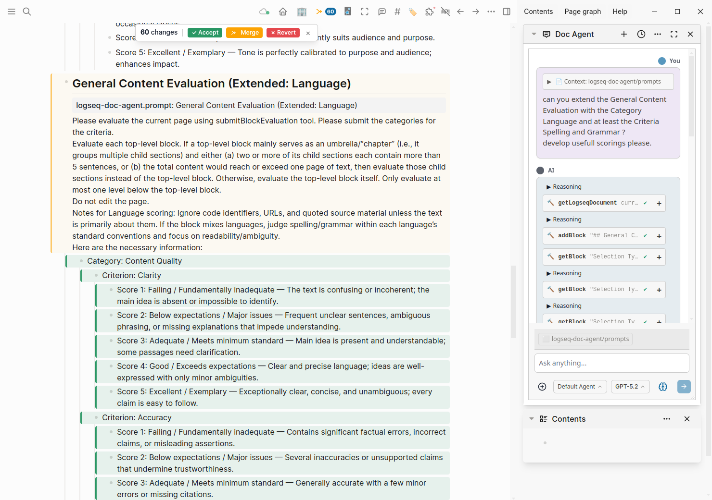
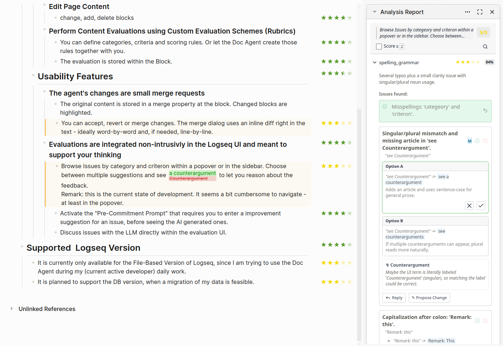
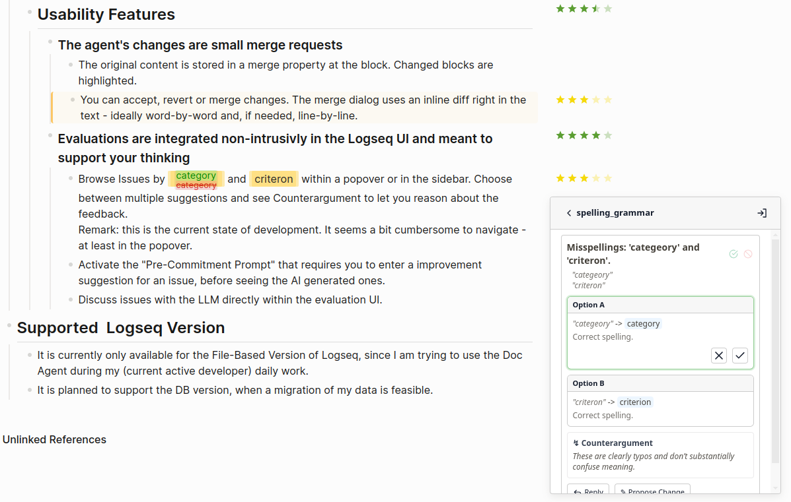

# Logseq Doc Agent

  

- The Doc Agent is inspired by modern IDE coding-agent integrations. It is a research prototype, but it is already useful in practice.
- The intent is to explore non-intrusive ways to integrate an agent into knowledge management and content creation systems like Logseq. Since Logseq is a thinking space, the Doc Agent shall be developed to support thought processes, not take them over.

## Available Features
  ### Agent capabilities
   Current features are limited to Editing and Evaluation / Feedback:  
   #### Edit Page Content
   - change, add, delete blocks
   #### Perform Content Evaluations using Custom Evaluation Schemes (Rubrics)
   - You can define categories, criteria and scoring rules. Or let the Doc Agent create those rules together with you.
   - The evaluation is stored within the block.
  ### Usability Features
   #### The agent's changes are small merge requests
   - The original content is stored in a merge property at the block. Changed blocks are highlighted. (see screenshot on top)
   - You can accept, revert or merge changes. The merge dialog uses an inline diff right in the text - ideally word-by-word and, if needed, line-by-line.
   #### Evaluations are integrated non-intrusively in the Logseq UI and meant to support your thinking
   - Browse Issues by category and criterion within a popover or in the sidebar. Choose between multiple suggestions and see a counterargument to let you reason about the feedback.
     Remark: This is the current state of development. It seems a bit cumbersome to navigate - at least in the popover.  
     

     

   - Activate the "Pre-Commitment Prompt" that requires you to enter an improvement suggestion for an issue, before seeing the AI generated ones.
   - Discuss issues with the LLM directly within the evaluation UI.

## Supported  Logseq Version
- It is currently only available for the File-Based Version of Logseq, since I am trying to use the Doc Agent during my daily work.
- It is planned to support the DB version, when a migration of my data is feasible.

## Current Insights
- The merge mode improves working with important documents by making changes easy to track and, if necessary, revert. Ideally, the diff and merge workflow would be integrated directly into the document; however, this functionality might also be better implemented in Logseq itself.
- The evaluation tool has the potential to become an important feedback mechanism. A few minor inconsistencies still need to be addressed. At the moment, it is not clear whether suggestions are meant to be applied directly or are intended as guidance for the user. Readability is not yet optimal.
   logseq-doc-agent.merge:: {"type":"update","base":"Das evaluation tool hat potenzial ein wichtiges feedback-werkzeug zu werden. Kleine Ungereimtheiten müssen noch überarbeitet werden. Aktuell ist nicht sichtbar, ob Vorschläge direkt anwendbar, oder an den Anwender gerichtet sind. Die Lesbarkeit ist noch nicht optimal. \nEventuell wäre ein \"Highlight all findings\"-mode im Dokument nützlich."}
      
   A “highlight all findings” mode within the document could also be useful.