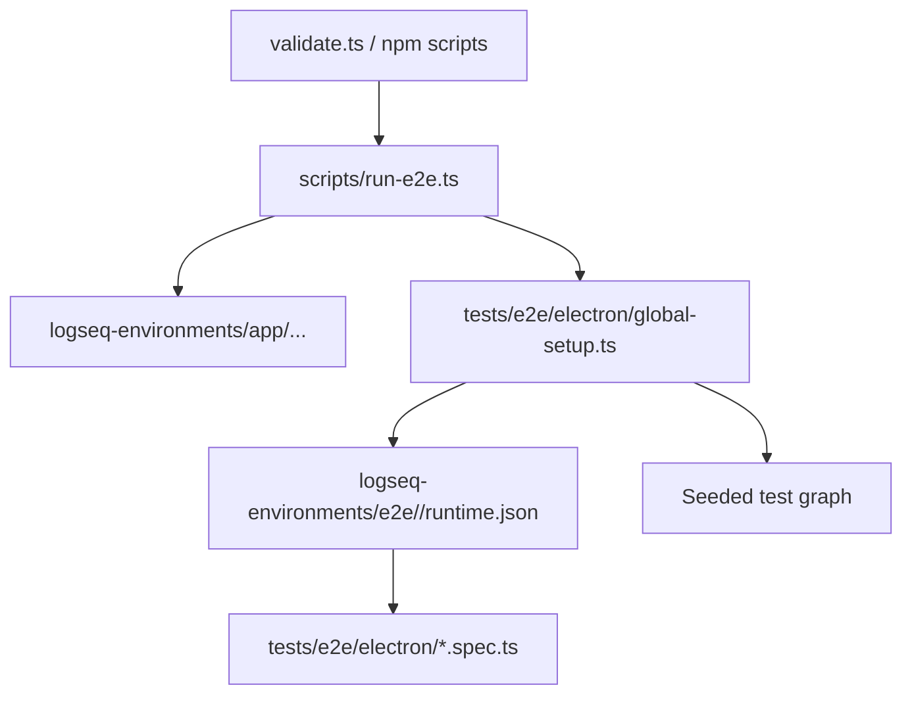

# E2E Testing with Playwright

End-to-end tests currently target a real Logseq Electron app through [Playwright](https://playwright.dev/). The repo supports two runtime channels:

1. `legacy` for the file-based Logseq runtime
2. `db` for the DB/beta runtime

The Playwright suite is shared across both channels. The channel-specific wrapper script prepares the correct binary and runtime profile, then launches the same Electron specs.

## Architecture Overview



### Key Components

| File                                | Purpose                                                  |
| ----------------------------------- | -------------------------------------------------------- |
| `playwright.config.ts`              | Configures the Electron test project                     |
| `scripts/run-e2e.ts`                | Resolves the requested Logseq channel and launches tests |
| `tests/e2e/electron/global-setup.ts`| Validates/init-checks runtime and seeds the test graph   |
| `tests/e2e/electron/`               | Electron integration tests                               |
| `tests/e2e/electron/runtime.ts`     | Loads the generated runtime configuration for each test  |

## NPM Scripts

| Script             | Command                               | Description                                              |
| ------------------ | ------------------------------------- | -------------------------------------------------------- |
| `test:e2e`         | `tsx scripts/run-e2e.ts legacy`       | Default E2E run on the `legacy` channel                  |
| `test:e2e:legacy`  | `tsx scripts/run-e2e.ts legacy`       | Explicit `legacy` channel run                            |
| `test:e2e:db`      | `tsx scripts/run-e2e.ts db`           | Explicit `db` channel run                                |
| `test:e2e:debug`   | `PWDEBUG=1 tsx scripts/run-e2e.ts legacy` | Debug the `legacy` channel in headed Playwright mode |
| `test:e2e:ui`      | `tsx scripts/run-e2e.ts legacy --ui`  | Open Playwright UI for the `legacy` channel              |

Use `legacy` for the normal local workflow. Run `db` when you need channel coverage or when you are changing code that can diverge across Logseq storage backends.

## Channel Setup

Each channel needs a one-time init step before tests can run.

### Legacy

```bash
npm run start:e2e:init:legacy
npm run test:e2e:legacy
```

During init, select:

```text
logseq-environments/e2e/legacy/graph
```

### DB

```bash
npm run start:e2e:init:db
npm run test:e2e:db
```

The DB channel uses:

```text
logseq-environments/e2e/db/home/logseq/graphs/Demo
```

## How Tests Launch Logseq

Tests use Playwright's `_electron` API to launch a real Logseq instance.

```ts
import { _electron as electron } from "@playwright/test";

const app = await electron.launch({
  executablePath: runtime.executablePath,
  args: [runtime.graphDir],
  env: { ...process.env, HOME: runtime.homeDir, XDG_CONFIG_HOME: runtime.xdgDir },
});
```

The `runtime.json` generated by `tests/e2e/electron/global-setup.ts` provides paths.

For the `db` channel, the managed test graph is seeded via the Logseq API into `logseq-environments/e2e/db/home/logseq/graphs/Demo` rather than a sibling `graph/` directory.

The Logseq binary source is configured in `logseq-versions.jsonc`. The runner script:

1. Reads the config for the requested channel (`legacy` or `db`)
2. Detects the current platform/arch
3. Resolves either a tagged GitHub release or a configured local binary directory
4. Extracts and caches it in `logseq-environments/app/...`
5. Exposes the resolved executable path to Playwright setup through environment variables

---

## Writing New Tests

### File Location

Place new specs in `tests/e2e/electron/` with the `.spec.ts` extension.

### Template

```ts
import fs from "node:fs";
import path from "node:path";
import { test, expect, _electron as electron } from "@playwright/test";

function loadRuntimeConfig() {
  const runtimePath = path.resolve("logseq-environments", "e2e", "legacy", "runtime.json");
  if (!fs.existsSync(runtimePath)) {
    throw new Error(`Runtime config not found at ${runtimePath}.`);
  }
  return JSON.parse(fs.readFileSync(runtimePath, "utf8"));
}

test("my feature test", async () => {
  const runtime = loadRuntimeConfig();

  const app = await electron.launch({
    executablePath: runtime.executablePath,
    args: [runtime.graphDir],
    env: {
      ...process.env,
      HOME: runtime.homeDir,
      XDG_CONFIG_HOME: runtime.xdgDir,
    },
  });

  try {
    const window = await app.firstWindow();
    await window.waitForLoadState("domcontentloaded");

    // Your test assertions here
    await expect(window.locator("body")).toBeVisible();
  } finally {
    await app.close();
  }
});
```

### Best Practices

- **Always close the app** in a `finally` block to avoid zombie processes
- **Use `loadRuntimeConfig()`** to get paths — don't hardcode them
- **Keep tests independent** — each test should set up its own state
- **Use meaningful test names** that describe the user-visible behavior
- **Leverage Playwright locators** (`getByRole`, `getByText`, `locator`) over raw CSS selectors

---

## CI Integration

- **Reporter**: Uses `blob` reporter in CI for parallel shard merging
- **Retries**: 2 retries in CI to handle flaky Electron startup
- **Traces**: Automatically recorded on first retry — upload `test-results/` as CI artifact for debugging

### Artifacts to preserve in CI

```
playwright-report/    # HTML report
test-results/         # Traces and screenshots
```

Both directories are `.gitignore`'d.

---

## Troubleshooting

| Problem                        | Solution                                                                                |
| ------------------------------ | --------------------------------------------------------------------------------------- |
| `LOGSEQ_EXECUTABLE is not set` | Run tests through `npm run test:e2e:legacy` or `npm run test:e2e:db`, not raw Playwright |
| `Runtime config not found`     | Global setup failed — check `logseq-environments/e2e/<channel>/runtime.json` exists     |
| Tests hang on Electron launch  | Increase `timeout` in config; ensure no other Logseq instance is running                |
| `test:e2e:ui` shows no tests   | Make sure specs are in `tests/e2e/electron/` and end with `.spec.ts`                    |
| Trace not recorded             | Traces are only captured on first retry; set `trace: "on"` temporarily to always record |

---

## MCP Integration (AI-Assisted Testing)

You can allow AI assistants to interact with the `logseq-sim` environment to help write UI-oriented Playwright tests or inspect plugin behavior before translating the findings into Electron E2E coverage.

### 1. Requirements

Since the MCP server acts against the simulator, you must first have the dev server running:

```bash
npm run dev
```

### 2. Add the MCP Server to your AI Client

Depending on your client, you need to configure the `test:mcp` script as a tool server.

For example, if your AI assistant supports a `.vscode/mcp.json` or a global configuration file, you would define the server like this:

```json
{
  "mcpServers": {
    "playwright": {
      "command": "npm",
      "args": ["run", "test:mcp"],
      "env": {
        // Any required env vars
      }
    }
  }
}
```

_Note: `npm run test:mcp` launches the `@playwright/mcp` command-line tool against `http://localhost:9000/tests/logseq-sim.html`._

### 3. Usage

Once configured, simply talk to your AI agent:

- _"Please explore the Logseq simulation and write a Playwright test that verifies the merge functionality."_
- _"Can you navigate to the Logseq Simulator and generate an Electron E2E test outline for the chat sidebar?"_

The AI can then produce Playwright code or locator guidance that you adapt into the `tests/e2e/electron/` suite.
