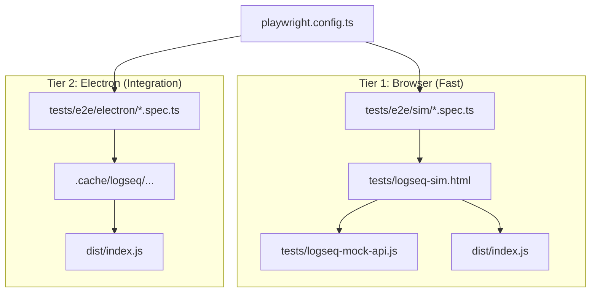

# E2E Testing with Playwright

End-to-end tests follow a two-tier strategy using [Playwright](https://playwright.dev/):

1.  **Tier 1 (Sim)**: Fast browser-based tests against `logseq-sim.html`. Focuses on UI components and plugin loading logic.
2.  **Tier 2 (Electron)**: Integration tests inside a real Logseq Electron application. Focuses on full API integration and graph lifecycle.

## Architecture Overview



### Key Components

| File | Purpose |
|------|---------|
| `playwright.config.ts` | Configures `sim` and `electron` projects + `webServer` |
| `tests/e2e/sim/` | Browser-based tests against the Logseq simulator |
| `tests/e2e/electron/` | Tests that launch Logseq via Electron |
| `tests/logseq-sim.html` | Entry point for simulation-based UI testing |
| `tests/logseq-mock-api.js` | Mock implementation of the Logseq SDK |
| `scripts/run-e2e.ts` | Orchestrator for full Electron test runs |

---

## NPM Scripts

| Script | Command | Description |
|--------|---------|-------------|
| **`test:e2e:sim`** | `playwright test --project=sim` | Run fast sim tests (auto-starts dev server) |
| `test:e2e:auto` | `tsx scripts/run-e2e.ts` | Full Electron run: setup binary + run tests |
| `test:e2e:ui` | `playwright test --ui` | Interactive UI mode for both projects |
| `test:e2e` | `playwright test` | Run ALL projects (requires `LOGSEQ_EXECUTABLE`) |

---

## Tier 1: logic-sim Testing

Simulation tests target `http://localhost:9000/tests/logseq-sim.html`. This environment mocks the Logseq API, allowing for instant feedback without Electron overhead.

### Visibility & Debugging

Use UI mode to see the simulator in action during tests:

```bash
npm run test:e2e:ui -- --project=sim
```

---

## Tier 2: Electron Integration

Tests use Playwright's `_electron` API to launch a real Logseq instance.

### How Tests Launch Logseq

```ts
import { _electron as electron } from "@playwright/test";

const app = await electron.launch({
  executablePath: runtime.executablePath,
  args: [runtime.graphDir],
  env: { ...process.env, HOME: runtime.homeDir, XDG_CONFIG_HOME: runtime.xdgDir },
});
```

The `runtime.json` (generated by `tests/e2e/electron/global-setup.ts`) provides paths.

The Logseq binary version is pinned in `logseq-versions.json`. The setup script:

1. Reads the config for the requested channel (`legacy` or `db`)
2. Detects the current platform/arch
3. Downloads the matching release from GitHub (if not cached)
4. Extracts and caches it in `.cache/logseq/<channel>/<tag>/<platform-arch>/`
5. Outputs `{ executablePath, ... }` as JSON

---

## Writing New Tests

### File Location

Place test files in `tests/e2e/` with the `.spec.ts` extension.

### Template

```ts
import fs from "node:fs";
import path from "node:path";
import { test, expect, _electron as electron } from "@playwright/test";

function loadRuntimeConfig() {
  const runtimePath = path.resolve(".tmp/runtime.json");
  if (!fs.existsSync(runtimePath)) {
    throw new Error(`Runtime config not found at ${runtimePath}.`);
  }
  return JSON.parse(fs.readFileSync(runtimePath, "utf8"));
}

test("my feature test", async () => {
  const runtime = loadRuntimeConfig();

  const app = await electron.launch({
    executablePath: runtime.executablePath,
    args: [runtime.graphDir],
    env: {
      ...process.env,
      HOME: runtime.homeDir,
      XDG_CONFIG_HOME: runtime.xdgDir,
    },
  });

  try {
    const window = await app.firstWindow();
    await window.waitForLoadState("domcontentloaded");

    // Your test assertions here
    await expect(window.locator("body")).toBeVisible();
  } finally {
    await app.close();
  }
});
```

### Best Practices

- **Always close the app** in a `finally` block to avoid zombie processes
- **Use `loadRuntimeConfig()`** to get paths — don't hardcode them
- **Keep tests independent** — each test should set up its own state
- **Use meaningful test names** that describe the user-visible behavior
- **Leverage Playwright locators** (`getByRole`, `getByText`, `locator`) over raw CSS selectors

---

## CI Integration

- **Reporter**: Uses `blob` reporter in CI for parallel shard merging
- **Retries**: 2 retries in CI to handle flaky Electron startup
- **Traces**: Automatically recorded on first retry — upload `test-results/` as CI artifact for debugging

### Artifacts to preserve in CI

```
playwright-report/    # HTML report
test-results/         # Traces and screenshots
```

Both directories are `.gitignore`'d.

---

## Troubleshooting

| Problem | Solution |
|---------|----------|
| `LOGSEQ_EXECUTABLE is not set` | Run `npm run test:e2e:auto` or export the var manually |
| `Runtime config not found` | Global setup failed — check `.tmp/runtime.json` exists |
| Tests hang on Electron launch | Increase `timeout` in config; ensure no other Logseq instance is running |
| `test:e2e:ui` shows no tests | Make sure specs are in `tests/e2e/` and end with `.spec.ts` |
| Trace not recorded | Traces are only captured on first retry; set `trace: "on"` temporarily to always record |
